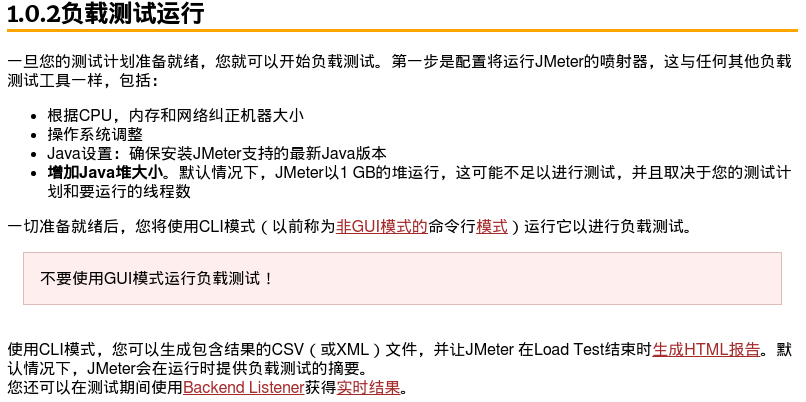
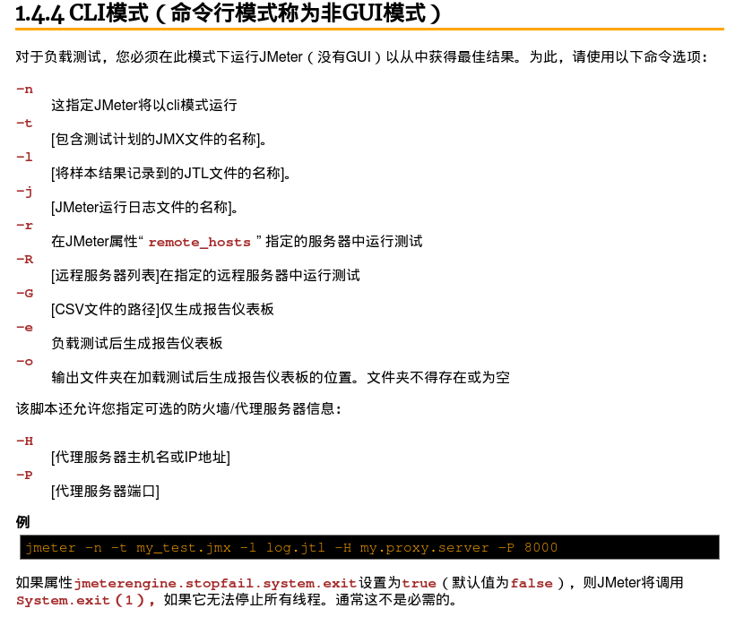

# JMeter

> 官网中提到不要使用 GUI 模式（界面模式进行负载测试）
>
> 原文如下：机翻：

## 命令行模式

### 基础

命令行模式在官网中有介绍使用方法，主要使用如下命令进行测试：

```sh
jmeter -n -t [测试计划.jmx] -l [结果保存文件名].jtl
```

其余指令：



### SSL

官网中无法找到（至少笔者无法找到）关于命令行模式时运行需要 SSL 的测试计划时的启动命令与指令，但通过其他资料，得知需要在命令行模式中运行 SSL，需要以下步骤：

1. 确保运行需要运行 jmeter 的机器上的 keystore 中包含 SSL 需要使用的证书以及其密钥。对于 caas 而言可以将 pfx 格式的证书转成 jks 格式证书，此时 keystore 会保存证书和密钥。使用命令如下：

```sh
keytool -importkeystore -srckeystore  [pfx格式证书名] -srcstoretype pkcs12 -destkeystore [转换成的jks证书名] -deststoretype JKS
```

2. 使用如下命令进行测试即可

```sh
jmeter -n -t [测试计划.jmx] -D javax.net.ssl.keyStore=[jks证书路径] -D javax.net.ssl.keyStorePassword=[jks证书密码]
```

### 修改 JVM 堆内存大小

```sh
HEAP="-Xms2G -Xmx2G" jmeter -n -t [测试计划.jmx]
```

## Linux 配置 Jmeter 所有用户可用

1. 切换到 root 用户，将 jmeter 放到 `/usr/local` 目录下。

2. `vi /etc/profile`，然后在相应位置（其实不影响的）添加以下配置：


```sh
...
export PATH USER LOGNAME MAIL HOSTNAME HISTSIZE HISTCONTROL

#set jmeter
export JMETER_HOME=/usr/local/apache-jmeter-5.1.1
export CLASSPATH=$JMETER_HOME/lib/ext/ApacheJMeter_core.jar:$JMETER_HOME/lib/jorphan.jar:$CLASSPATH
export PATH=$JMETER_HOME/bin:$PATH:$HOME/bin


# By default, we want umask to get set. This sets it for login shell
...
```


3. 保存退出文档，使用 `. /etc/profile` 生效配置

4. 切换到自己的用户下，就可以直接使用 jmeter 命令了

## 将测试报告转存为 html 格式

测试报文格式 jtl，可以使用以下命令将报告转为 html 格式，最后出来是一个文件夹

```shell
jmeter -g [测试报告.jtl] -o [生成的文件夹名字]

# 测试后直接将结果转换为 html 格式
jmeter - n -t .jmx -l .csv -e -o xxx
```

