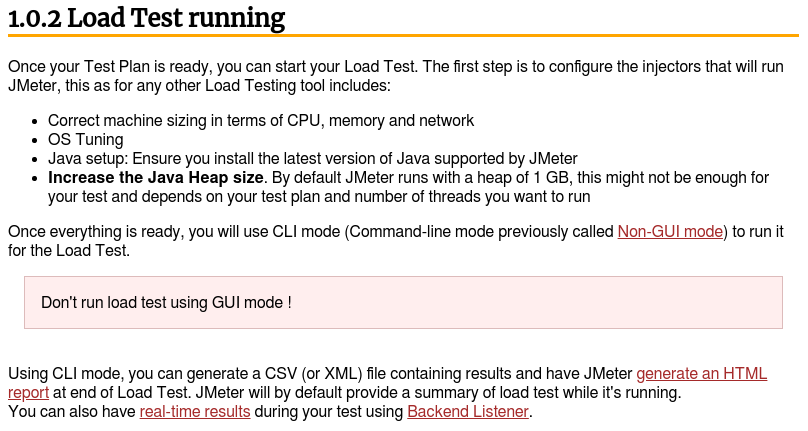

# JMeter

> 官网中提到不要使用 GUI 模式（界面模式进行负载测试）
>
> 原文如下：机翻：

## 命令行模式

### 基础

命令行模式在官网中有介绍使用方法，主要使用如下命令进行测试：

```sh
jmeter -n -t [测试计划.jmx] -l [结果保存文件名].jtl
```

其余指令：


### SSL

官网中无法找到（至少笔者无法找到）关于命令行模式时运行需要 SSL 的测试计划时的启动命令与指令，但通过其他资料，得知需要在命令行模式中运行 SSL，需要以下步骤：

1. 确保运行需要运行 jmeter 的机器上的 keystore 中包含 SSL 需要使用的证书以及其密钥。对于 caas 而言可以将 pfx 格式的证书转成 jks 格式证书，此时 keystore 会保存证书和密钥。使用命令如下：

```sh
keytool -importkeystore -srckeystore  [pfx格式证书名] -srcstoretype pkcs12 -destkeystore [转换成的jks证书名] -deststoretype JKS
```

2. 使用如下命令进行测试即可

```sh
jmeter -n -t [测试计划.jmx] -D javax.net.ssl.keyStore=[jks证书路径] -D javax.net.ssl.keyStorePassword=[jks证书密码]
```

### 修改 JVM 堆内存大小

```sh
HEAP="-Xms2G -Xmx2G" jmeter -n -t [测试计划.jmx]
```

