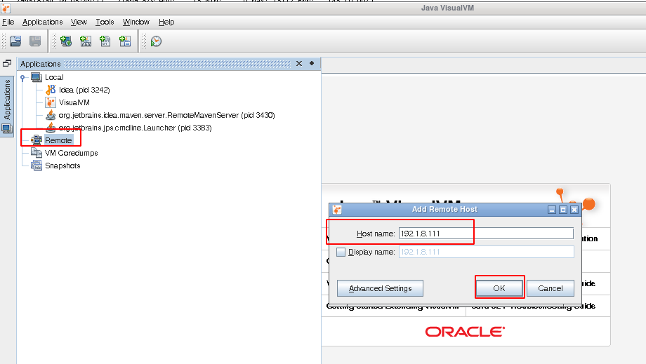
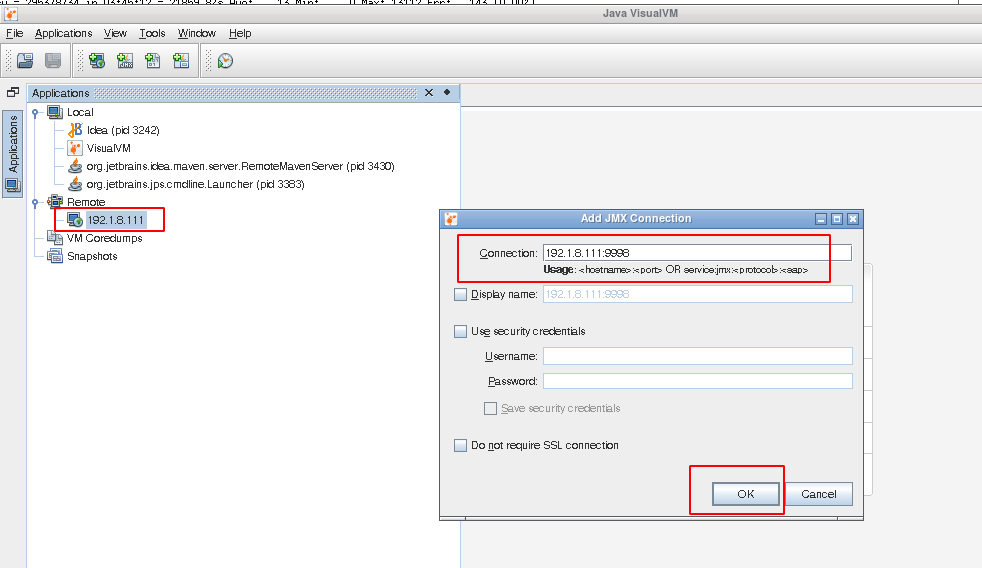
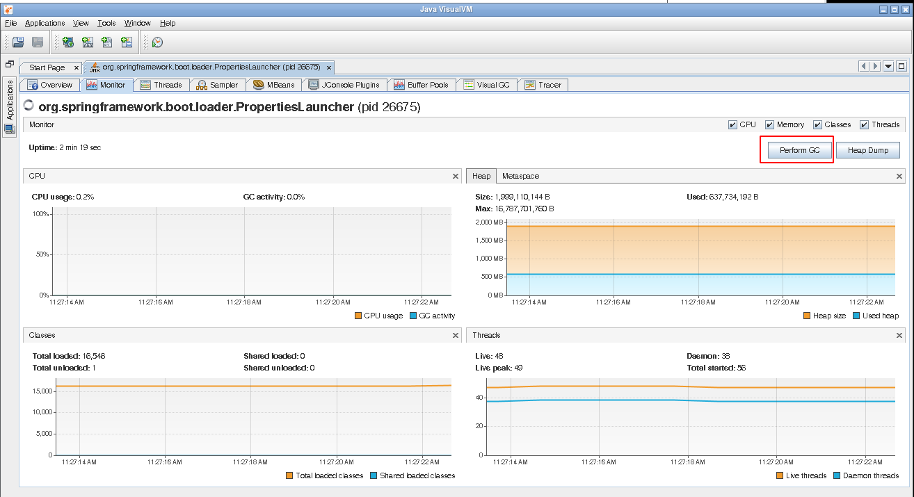
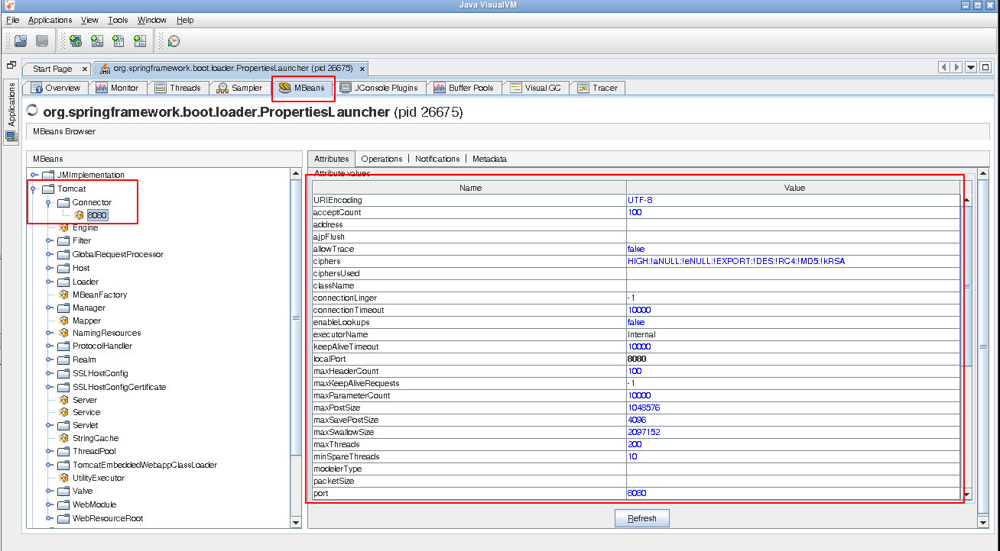

# Jvisualvm

jvisualvm 是 oracle-jdk 中一个有图形界面的监控程序工具，可以监控 java 程序线程、GC等情况。

## 远程使用

jvisualvm 提供远程连接功能，方便 java 程序运行在没有图形界面的服务器上，而 jvisualvm 则启动在有图形界面的机器上，方便观察。

要使用远程连接功能，有两种办法，第一种相对很简单，第二种不一定可以。需要以下步骤：

- 第一种方法

  在 JVM 参数中添加以下命令，即可：

  ```sh
  -Dcom.sun.management.jmxremote.port=12345 -Dcom.sun.management.jmxremote.ssl=false -Dcom.sun.management.jmxremote.authenticate=false
  ```

- 第二种方法

1. 在准备启用 jvisualvm 的机器和被监控的服务器上，都需要有 oracle-jdk （仅使用其中的部分指令，不需要配置到环境变量中）

2. 在服务器上启动 jstatd 连接

```java
（1）找到 oracle-jdk 中 lib 文件夹下的 tools.jar 的路径
（2）创建 jstatd.all.policy 文件（文件名非固定），文件内容为：
grant codebase "file:[tools.jar 的路径]" {  
   permission java.security.AllPermission;  
};
（3）使用如下命令启动 jstatd 连接（jstatd 在 oracle-jdk/bin 下）
jstatd -J-Djava.security.policy=[jstatd.all.policy的路径]
```

3. 在服务器上启动 jmx 连接

```java
在 java 程序的启动项里添加如下指令：
（
	对于 caas 则在 service.sh 启动脚本中添加，注意脚本中使用 “\” 换行。添加位置如下：
	if [ "$1" = "run" ]; then
    shift
    cd $SERVICE_HOME
    eval exec "\"$_RUNJAVA\"" \
        -classpath "\"$CLASSPATH\"" \
        -Djava.ext.dirs=lib:$ext_lib \
        -Dloader.path=lib,bin \
        -Djava.net.preferIPv4Stack=true \
        [添加位置]
        -Dspring.config.location="\"$SPRING_CONFIG\"" \
        org.springframework.boot.loader.PropertiesLauncher "$SERVICE_CONFIG"
            
     或
     
    touch "$SERVICE_OUT"
    cd $SERVICE_HOME
    eval "\"$_RUNJAVA\"" \
        -classpath "\"$CLASSPATH\"" \
        -Dservice.id="\"$SERVICE_ID\"" \
        -Djava.ext.dirs=lib:$ext_lib \
        -Dloader.path=lib,bin \
        -Djava.net.preferIPv4Stack=true \
        [添加位置]
        -Dspring.config.location="\"$SPRING_CONFIG\"" \
        org.springframework.boot.loader.PropertiesLauncher "$SERVICE_CONFIG" \
        >> "$SERVICE_OUT" 2>&1 &
）
-Djava.rmi.server.hostname=[服务器所在IP地址]
-Dcom.sun.management.jmxremote
-Dcom.sun.management.jmxremote.port=[jvisualvm连接服务器使用的端口，不是caas启动的端口]
-Dcom.sun.management.jmxremote.authenticate=false
-Dcom.sun.management.jmxremote.ssl=false
```

4. 启动 jvisualvm 并创建远程连接

（1）右键 `Remote` => 选择创建远程连接，并填入需要连接的服务器（这里以192.1.8.111为例），然后点击 `OK`



（2）右键刚刚创建的服务器连接 => 选择添加 jstatd 连接，默认配置即可

（3）右键服务器连接 => 选择添加 jmx 连接，在 `Connection` 中填入上面启动 jmx 时设置的端口号（这里以 9998 为例），然后点击 `OK` 



经过以上步骤，就可以将 jvisualvm 远程连接到服务器上观察运行的 java 程序。

>  注意
>
> 1. 观察时使用 jmx 连接
> 2. 若 java 程序重启，则移除 jmx 连接再次新建即可
> 3. jstatd 和 jmx 都启动后，才可以在 jvisualvm 中观察到所有数据，否则会存在 CPU 或 GC 无法观察

## jvisualvm 影响 java 程序

在 jvisualvm 中有一些功能可以直接影响到正在监控的 java 程序，如 手动 GC 与 调整 Tomcat 参数（如果有）。

### 手动 GC

点击下图中的按钮即可手动触发 GC



### 调整 Tomcat 参数

在 jvisualvm 中可以不重启 java 程序就能修改 tomcat 参数，方便 tomcat 参数的调整测试。



