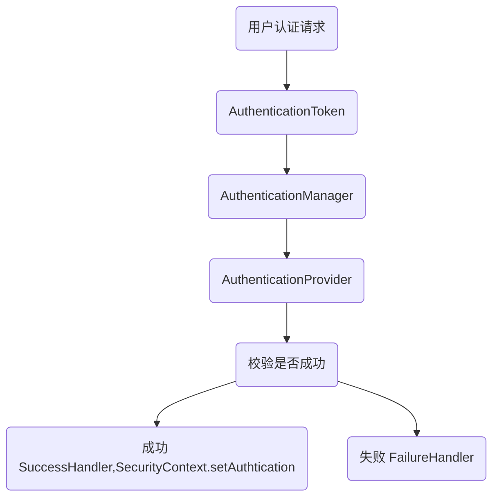

# Spring Boot + Spring Security + JWT 做认证和授权

## spring security 核心概念

- **AuthenticationManager** - 用户认证的管理类。
所有的认证请求都会通过提交一个 token (AuthenticationToken) 给 AuthenticationManager#authenticate() 方法来实现。
但具体的校验 token 不是由它来做，它会将请求转发给具体的实现类。

- **AuthenticationProvider** - 认证的具体实现类，AuthenticationManager 接收到的认证请求就是转发给它来做的。
一个 AuthenticationManager 可以包含多个 provider，每个 provider 通过实现一个 support 方法来表示自己支持那种 Token 的认证。
AuthenticationManager 默认的实现类是 ProviderManager。
一个 provider 是一种认证方法的实现，比如：
  - 提交的用户名密码，通过数据库查询 user 数据作对比的，就是 DaoProvider
  - 通过 CAS 请求单点登录系统实现，就是 CASProvider。
  - 还有很多，Spring Security 做了很多默认的实现。（也包括 SAML）

- **SecurityContext** - 当用户认证通过之后，就会为用户生成一个唯一的 SecurityContext，里面包含用户的认证信息 Authentication。
通过 SecurityContext 我们可以获取到用户的标识 Principle （其中包含用户的信息，比如用户名之类的。在 Spring Seucrity 中可以通过注解 @AuthenticationPrincipal 直接获取到）
和授权信息 GrantedAuthrity（其中包含用户的角色信息 Role）。
在系统的任何地方，只要通过 SecurityHolder.getSecurityContext() 就可以获取到 SecurityContext。

**认证流程图**

