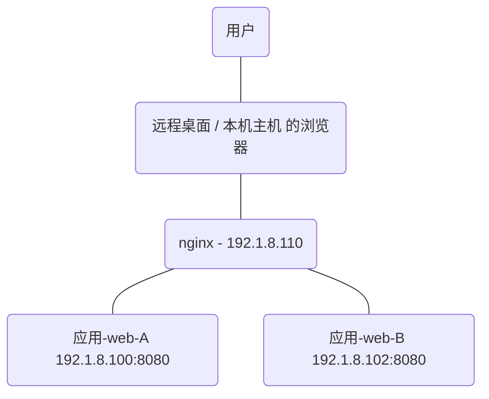

# Spring Security SAML session 管理研究

## 现有情况

目前 应用-web 与 Spring Security SAML 整合后，还有 session 在集群中共享（即缓存）的问题。

在未加入 session 缓存的时候，系统正常，但因为集群的原因必须加入 session 缓存管理（避免多服务器时需要重复登录问题）。

加入 session 缓存（Spring 提供）后，系统出现问题，问题情况表现在系统不断的创建新的 session，特别是当 应用-web 跳转到 IDP 登录时创建的新 session，导致了 SAML 流程中发送认证请求的 session 与接收到断言的 session 不一致，断言验证失败，从而出现了不断在 `/saml/login` 到 `IDP 登录地址` 的不断循环。

## 尝试 1 - 替换 SAMLMessageStorageFactory - 失败

在调试上述系统 session 的创建过程中，我们发现了创建的源头在 `org.springframework.security.saml.storage.HttpSessionStorageFactory#getMessageStorage` 方法中，同时 `HttpSessionStorageFactory` 是 `SAMLMessageStorageFactory` 接口的实现类，而 `SAMLMessageStorageFactory` 是可以注入自定义的实现类从而替换正在使用的 `HttpSessionStorageFactory`。

于是，仿照 `HttpSessionStorageFactory` 类进行自定义：

```java
// Spring 代码
public class HttpSessionStorageFactory implements SAMLMessageStorageFactory {
    public SAMLMessageStorage getMessageStorage(HttpServletRequest request) {
        return new HttpSessionStorage(request);
    }
}

...
public HttpSessionStorage(HttpServletRequest request) {
    Assert.notNull(request, "Request must be set");
    this.session = request.getSession(true);
}
...

// 自定义
public class WebSessionStorageFactory implements SAMLMessageStorageFactory {
    @Override
    public SAMLMessageStorage getMessageStorage(HttpServletRequest request) {
        return new WebSessionStorage(request);
    }
}

...
public WebSessionStorage(HttpServletRequest request) {
    if (request.getRequestURI().contains("/saml/login")) {
        this.session = request.getSession(true);
    } else {
        this.session = request.getSession(false);
    }
}
...
```

**同时，加入了之前 应用 的 session 缓存管理。**

> 之前 应用 的 session 缓存管理的大概原理：
>
> 1. Spring 提供了注解 `@EnableSpringHttpSession`，加入该注解后，开启 Spring 提供的关于 session 管理，可自定义
> 2. 加入注解后，Spring 要求一个 SessionRepository 实现类，这个类中主要是定义 session 的创建、查询、保存、删除方法。之前 应用 就是在这里手动在各方法完成对应的缓存操作。
> 3. 加入自己自定义的 session 类，当然，是需要实现指定 Session 接口的。
>
> 在加入以上内容后，session 的创建、查询、保存、删除，就替换成自定义的方法，session 的实际类型也变为了自己定义的 session 类。

替换使用自定义的 `SAMLMessageStorageFactory` 后，发现的确已经将自定义的 `SAMLMessageStorageFactory` 加入到 Spring 容器中，实现类中方法也正常生效了。的确，自定与的 `request.getSession(true)` 可以与 Spring 代码中一样创建新的 session，但是却**无法从 `request.getSession(false)` 中获取到已经创建过的 session（实际上这语句返回了 null），所以替换 `SAMLMessageStorageFactory` 方法失败了**。

这个方法可能需要进一步修改 `request.getSession(boolean)` 中的内容，但其中的代码是属于 Tomcat 的。

原有代码中 `request.getSession(true)` 既可以在需要时创建出新的 session，也可以在已经有 session 时返回已有 session，这是因为 request 本身就属于 Tomcat 自身保存的，session 的创建等方法也同属于 Tomcat。但通过 Spring 添加自定义的 session 管理后，却无法像 Tomcat 一样通过上下文获取到已经创建的 session，也就是 `request.getSession(false)` 返回 null 的原因。

## 尝试 2 - 添加 Spring Session Hazelcast - 尝试中

### Spring Session Hazelcast 配置：

> 以下配置都可以从 Spring Session 官方文档中找到，[官方 Sample](<https://github.com/spring-projects/spring-session/tree/master/spring-session-samples/spring-session-sample-javaconfig-hazelcast>)

1. 添加注解 `@EnableHazelcastHttpSession` 到 Hazelcast 配置类中，可使用注解属性 `maxInactiveIntervalInSeconds` 设置 session 的超时时间，如 `@EnableHazelcastHttpSession(maxInactiveIntervalInSeconds = 900)`，表示超时时间 900 秒。

2. Spring 将 session 缓存管理部分直接交由 Hazelcast ，所以需要在 Hazelcast 创建的类中加入指定的缓存空间配置：

   ```java
   final MapAttributeConfig sessionMapConfig = new MapAttributeConfig().setName(HazelcastIndexedSessionRepository.PRINCIPAL_NAME_ATTRIBUTE).setExtractor(PrincipalNameExtractor.class.getName());
   
   // com.hazelcast.config
   config.getMapConfig(HazelcastIndexedSessionRepository.DEFAULT_SESSION_MAP_NAME).addMapAttributeConfig(sessionMapConfig).addMapIndexConfig(new MapIndexConfig(HazelcastIndexedSessionRepository.PRINCIPAL_NAME_ATTRIBUTE, false));
   ```

3. 继承 `AbstractSecurityWebApplicationInitializer`，指明系统中的 Spring Security 配置类与 Spring Session 配置类（即标注了 `@EnableHazelcastHttpSession` 的类，同时也是 Hazelcast 配置类）

   ```java
   public class SecurityInitializer extends AbstractSecurityWebApplicationInitializer {
       public SecurityInitializer() {
           super(WebSecurityConfig.class, HazelcastConfiguration.class);
       }
   }
   ```

4. 继承 `AbstractHttpSessionApplicationInitializer`，只需要继承即可，用于让 Spring Session 的 Filter 先运行于 Spring Security 的 Filter。

### Spring Session Hazelcast 与原有 应用 session 管理

Spring Session Hazelcast 实与之前 应用 管理 session 的方法差不多：

1. 缓存部分交由了 Hazelcast 进行管理，用户则只需要按照配置将缓存 session 的缓存空间设置好即可。

2. 同样需要 SessionRepository，只不过这部分代码 Spring Session 已经替你写了，通过 `@EnableHazelcastHttpSession` 注解就加入到了 Spring 容器中。

3. **不同于以前方法地发是**，Spring Session 还实现了接口 `HttpServletRequest`，而且 Spring Session 应该在实现这个接口时继承了 `HttpServletRequest` 的一个实现类 `HttpServletRequestWrapper`，使得部分方法为 Tomcat 原生的方法。

   **这个 `HttpServletRequest` 或者 `HttpServletRequestWrapper`，都是 Tomcat 的代码，里面就定义了 `request.getSession` 的方法**，重写 `HttpServletRequest` 的 Spring Session 明显解决了 [尝试 1](尝试 1 - 替换 SAMLMessageStorageFactory - 失败) 中出现的问题。

### 添加后效果

添加 Spring Session Hazelcast，为 session 缓存空间添加了缓存监听器，可以看到 session 的正常缓存，单个实例系统也可以正常运行了。

在集群中使用，则还需要使用 nginx 进行负载测试。现有网络图大概如下：



有如下 nginx 配置：

```
...
http {
	...
	upstream nginxdemo {
        server 192.1.8.100:8080;
        server 192.1.8.102:8080;
	}
	
    server {
        listen 80;
        server_name localhost;
        
        location / {
            proxy_pass http://nginxdemo;
        }
    }
    ...
}
```

> 此时，OKTA IDP 应该配置：
>
> SSO 地址：http://nginxdemo/saml/SSO
>
> SLO 地址：http://nginxdemo:80/saml/SSO
>
> SLO 时会对比登出响应中的 SLO 地址与实际请求地址是否一致，所以需要添加上 80 端口号

经过这样配置后，在登录 IDP 时，nginx 将所有从 192.1.8.110:80 地址进入的请求都转发到 http://nginxdemo/ 中。

**但是，因为远程桌面浏览器无法解析到 nginxdemo 这个域名表示 192.1.8.110，所以无法进一步测试。**

有如下解决方法：

- 远程桌面安装 nginx
- 远程桌面帮忙配置域名解析
- 本地主机开放 OKTA 网站（已开放）

在本地主机开放 OKTA 网站后，有以下测试结果：

1. 现在集群可以进行 SSO 登录了，而且进入网页后点击也不会因为负载不同服务器的原因需要重新登录。

2. 集群进行请求和响应时，都被 nginx 负载了，这表示发送认证请求和接受断言响应的不是在同一服务上。

3. 集群在进行 SSO 时，存在失败情况，原因可能是第 2 点导致的

4. 集群无法进行登出，报 “登出响应验证不通过”，具体错误：

   ```
   Destination in the LogoutResponse was not the expected value http://nginxdemo/saml/SingleLogout
   ```

## 单个实例 SAML 流程

只有 100 服务器

```properties
# 打开 应用 登录页
100 服务器没有新建 session

# 点击 应用 的登录
{100}
1. 新建 session1
2. session 加入缓存
3. 发送 认证请求1 ,认证请求的信息索引为 Id1
4. 将 Id1 保存到 session1 中
5. 更新缓存

# 点击 IDP 登录
{100}
1. 返回断言1,因为这个断言是响应 Id1 的
2. Id1 可以从 session1 中找到，清除 Id1
6. 验证 断言1 成功
```

## 集群下 SAML 流程

```properties
# 打开 应用 登录页
100、102 服务器都没有新建 session

# 点击 应用 的登录
{102}
1. 新建 session1
2. session 加入缓存
3. 发送 认证请求1 ,认证请求的信息索引为 Id1
4. 将 Id1 保存到 session1 中
5. 更新缓存

{100}
1. 接收到新建 session1 的缓存通知
2. 接收到更新 session1 的缓存通知

# 点击 IDP 登录
{100}
1. 新建 session2
2. 返回断言1,因为这个断言是响应 Id1 的
3. session2 中无法找到 Id1，验证 断言1 失败，登录失败
4. （102 服务重新发送 认证请求2 后）接收到 断言2，它是响应 Id2 的
5. Id2 可以从 session2 中找到，清除 Id2
6. 验证 断言2 成功

{102}
1. 接收到新建 session2 的缓存通知通知
2.（在 100 服务器验证 断言1 失败，登录失败后）重新发送 认证请求2，索引 Id2
3. 保存 Id2 到 session2 中
4. 更新缓存
```

### 研究

系统寻找 session 有两种方法：

- 从 request 的 attribute 中直接读出 currentSession
- 如果没有找到 currentSession，则通过 `cookieSerializer.readCookieValues(request);` 读取 request 中的 cookie，因为 Spring Session Hazelcast 创建的 session 会保存到 cookie

集群情况下，不管是否将请求和响应都负载到同一服务器上，同样会出现找不到 session，从而新建 session 的情况。

发现**集群负载到同一服务器**和**单台实例**的情况下，点击 应用 登录页并跳转到 IDP 登录页时，都会创建一个 session，同时记录到 Cookie 中，名为 SESSION。Cookie 在项目的域上。

但当到达 IDP 登录页时，因为 IDP 在其他域上，**无法观察此时 系统域上的 Cookie 情况**，但此时浏览器中，无论**集群负载到同一服务器**和**单台实例**都无法发现有 SESSION 数据。

点击 IDP 登录后，页面跳转回系统：

- **集群负载到同一服务器**的情况下，系统判断无法找到session，并创建新 session，从而出现问题。
- **单台实例**的情况下，系统判断可以找到 session，并创建新 session，没有问题。

### 解决

当使用 192.1.8.110 地址打开 应用 登录页时，点击 应用 登录页面后创建的 session1，记录在 Cookie 中，其中的 Domain 为 192.1.8.110。

在点击 IDP 登录并，成功登录后，查看 session，虽然是新建的 session2 ，但是发现记录 session 的 Cookie Domain 为 nginxdemo。

发现两个 Cookie 的 Domain 不一致。

所以尝试使用 nginxdemo 域名打开 应用 登录页，发现 session1 的 Domain 同样为 nginxdemo。而这次，当在 IDP 点击登录后，不会再新建 session2，而是使用 session1。

问题解决。

### 解决 SLO 登出问题

调试发现 SAML 代码中会判断 SLO 的 **登出响应目标地址** 和 **实际登出响应地址** 是否一致。当 IDP 的 SLO 地址配置为 `http://nginxdemo/saml/SingleLogout` 时，与实际的登出响应 `http://nginxdemo:80/saml/SingleLogout` 不一致，所以无法登出。

将 IDP 的 SLO 调整为 `http://nginxdemo:80/saml/SingleLogout` 即可。

### Cookie 的 SameSite 

Spring session 对 session 的管理，会依赖到 cookie。它会把 sessionId 记录到 cookie 中。
而 Spring session 在 request 中无法通过 attribute 获取到已经创建了的 session 时，
则会尝试从 cookie 中找到 sessionId，并通过这个 sessionId 在缓存中找到对应的 session。

但是如果 cookie 的 SameSite 为 Lax，则表示 cookie 将不会附带于在任何 POST 类型的请求。
而 SAML 2.0 中，从 IDP 登录后跳转回 SP 的过程则是通过 POST 请求完成的。
所以，无法带有 cookie 的 POST 请求，将会导致 Spring session 无法找到已经缓存的 session，从而新建 session，导致 SAML 验证失败。

避免以上情况也很简单，可以使用 spring 提供的 CookieSerializer 来修改默认的 SameSite。
```java
@Bean
public CookieSerializer cookieSerializer() {
    DefaultCookieSerializer serializer = new DefaultCookieSerializer();
    // SameSite.None 不同于 null
    serializer.setSameSite(CookieHeaderNames.SameSite.None.name());
    return serializer;
}
```

