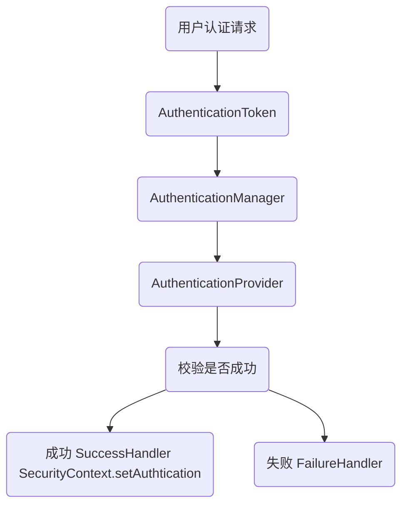

# Spring Boot + Spring Security + JWT 做认证和授权

## spring security 核心概念

- **Filter** - 因为 AuthenticationManager 需要一个 AuthenticationToken，所以当用户请求进来时，
过滤器的工作就是将请求头中字符串类型的 token 封装为一个 AuthenticationToken，然后通过 AuthenticationManager#authenticate() 方法来处理 token。

- **AuthenticationManager** - 用户认证的管理类。
所有的认证请求都会通过提交一个 token (AuthenticationToken) 给 AuthenticationManager#authenticate() 方法来实现。
但具体的校验 token 不是由它来做，它会将请求转发给具体的实现类。

- **AuthenticationProvider** - 认证的具体实现类，AuthenticationManager 接收到的认证请求就是转发给它来做的。
一个 AuthenticationManager 可以包含多个 provider，每个 provider 通过实现一个 support 方法来表示自己支持那种 Token 的认证。
AuthenticationManager 默认的实现类是 ProviderManager。
一个 provider 是一种认证方法的实现，比如：
  - 提交的用户名密码，通过数据库查询 user 数据作对比的，就是 DaoProvider
  - 通过 CAS 请求单点登录系统实现，就是 CASProvider。
  - 还有很多，Spring Security 做了很多默认的实现。（也包括 SAML）
  
- **UserDetailsService** - 在 AuthenticationProvider 中可以使用 UserDetailsService#loadUserByUsername 方法来加载用户。
```java
UserDetails user = userService.loadUserByUsername(name);
```

- **UserDetails** - 在 UserDetailsService#loadUserByUsername 中，需要在最后返回一个 UserDetails 对象，
可以自己继承 UserDetails 来定义自己的属性，在 AuthenticationProvider 的最后返回 UserDetails 对象的时候，需要强制转回自定义的 UserDetails。
```java
return new SamlAuthToken((强制转回自定义的 UserDetails)user, token, user.getAuthorities(), assertion);
```

- **SecurityContext** - 当用户认证通过之后，就会为用户生成一个唯一的 SecurityContext，里面包含用户的认证信息 Authentication。
通过 SecurityContext 我们可以获取到用户的标识 Principle （其中包含用户的信息，比如用户名之类的。
在 Spring Seucrity 中可以通过注解 @AuthenticationPrincipal 直接获取到）
和授权信息 GrantedAuthrity（其中包含用户的角色信息 Role）。
在系统的任何地方，只要通过 SecurityHolder.getSecurityContext() 就可以获取到 SecurityContext。

**认证流程图**



## Web Filter

对于 web 项目而言，进入认证的最佳入口就是 Filter 了。而 spring security 也通过 filter 实现了很多默认的认证逻辑，和常见的 web 攻击的防护。

### 常见 filter

下面按 request 进入的顺序列举一下常用的 filter：

- SecurityContextPersistenceFilter - 用于将 SecurityContext 放入 Session 的 filter
- UsernamePasswordAuthenticationFilter - 登录认证的 filter（默认拦截 POST /login 的登录接口，是通过 form 形式的登录），类似的还有 CasAuthenticationFilter、BasicAuthenticationFilter 等。
在这些 filter 中生成用于认证的 token，提交到 AuthenticationManager，如果认证失败会直接返回。

- RemeberMeAuthenticationFilter - 通过 cookie 来实现 remember me 功能的 filter
- AnonymousAuthentication - 如果一个请求在到达这个 filter 前 SecurityContext 没有初始化，则这个 filter 会默认生成一个匿名 SecurityContext。这在支持匿名用户的系统中非常有用。
- ExceptionTranslationFilter - 捕获所有 Spring Security 抛出的异常，并决定处理方式
- FilterSecurityinterceptor - 权限校验的拦截器，访问的 url 权限不足时会抛出异常